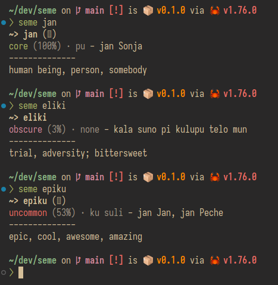

# seme

toki pona word look-up in the CLI



## Installation

Using `cargo`: `cargo install --git https://Brian3647/seme`

## Usage

```sh
Usage: seme [OPTIONS] <WORD>

Arguments:
  <WORD>  The word to get the definition of

Options:
  -j, --json         Show the RAW JSON response from the API
  -t, --toki <TOKI>  The language used to get the word definitions. [default: en]
  -h, --help         Print help
```

```sh
# Examples

seme # defaults to `toki`
seme jan
seme toki --json # raw json data
seme nanpa --toki es # give the definition in spanish
```
